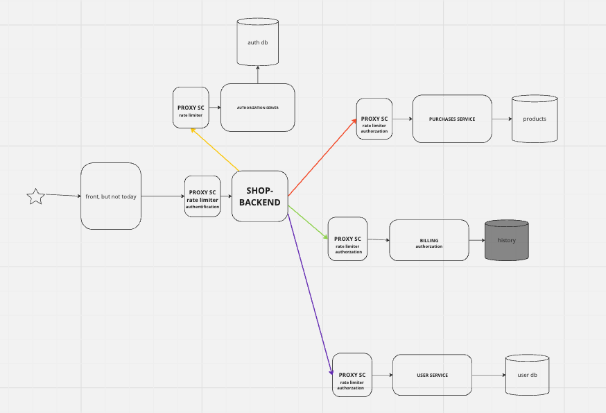

*Как тестировать?*

Для начала запустить все через `docker-compose up --build` из директории `crud`

Поменять username в тестере и запустить `python3 tester.py` из директории `crud`
Там автоматически расставлены ассерты, которые проверяют, что флоу работает так, как надо. 
Архитектура проекта соответствует приложенной архитектуре.

Есть небольшой недостаток в виде того, что базы данных пока в sqlite3 и никак не изолированы, но кажется это в текущей домашке не должно быть проблемой,
так как основным требованиям безопасности все удовлетворяет. На каждом сервисе есть дополнительный сайдкар для авторизации, который позволяет
По токену авторизовать пользователя. Все внешнее апи в бекенде. Оно соединяет все сервисы в одно целое.
Предполагается, что будет дополнительный L3 балансер и несколько инстансов одного и того же бекенда для распределения запросов.


Описание API
```
POST /billing/balance/add

params:
    username string
    amount   int
response
    status: ok
```

```
POST /billing/balance/sub

params:
    username string
    amount   int
response
    status: ok
```

```
GET /billing/balance

params:
    username string
response
    balance int
```

Секция с user, все как в предыдущей домашке, только убрал {username}, так как его можно достать с токена
```
GET /user
POST /user
PUT /user
DELETE /user
```

```
GET /token

params:
    username string
    password string
response
    token string
```

```
GET /order

params:
    order_id string
response
     order Order:
        	order_id int
            product_id int
            price     int
            count     int
            username  string 
            paid      int
```

```
GET /orders

params:
    count int // по сути это лимит
response
    orders []Order: ...
```

```
POST /buy

params:
    count      int
    price      int
    product_id int
response
    order_id int
    total_price int
```


Пока что внешний интерфейс описан так. Хотелось его конечно описать в каком-нибудь сваггере, но не успеваю в дедлайн =(

Посмотреть на структуру можно 